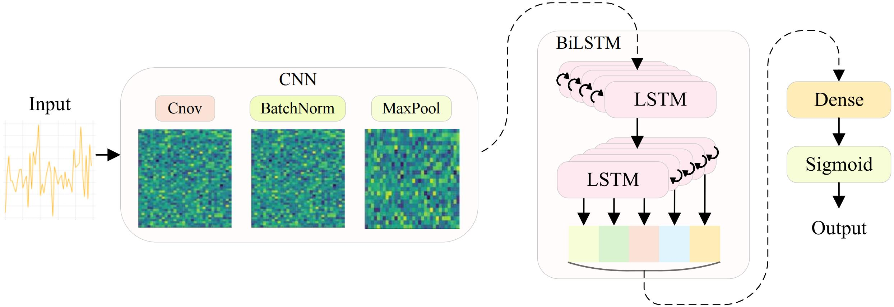

# 🧠 SM-CBNet: A Speech-Based Parkinson’s Disease Diagnosis Model with SMOTE–ENN and CNN+BiLSTM

> A reproducible implementation for the ICIC 2025 oral presentation:
> [📄 Springer Chapter](https://link.springer.com/chapter/10.1007/978-981-95-0030-7_4)

---

## 📚 Introduction

This repository contains the full pipeline for reproducing the paper titled:

**"SM-CBNet: A Speech-Based Parkinson’s Disease Diagnosis Model with SMOTE–ENN and CNN+BiLSTM"**, accepted at the **2025 International Conference on Intelligent Computing (ICIC)**.

<div align="center">
  
</div>

Parkinson's disease (PD) is the second most prevalent neurodegenerative disorder worldwide. Speech-based diagnostic approaches for PD have attracted increasing attention, with deep learning models demonstrating promising performance. In this paper, we propose a speech-based diagnostic model for PD, aiming to enhance the diagnostic accuracy using deep learning techniques. We adopt the SMOTE–ENN oversampling method to solve the data imbalance problem, and develop a hybrid model that integrates a Convolutional Neural Network (CNN) and Bi-directional Long and Short-Term Memory network (BiLSTM) to efficiently extract the speech features and capture temporal dependencies.

---

## 📦 Dataset Preparation

We use two public datasets:

* 🧾 [Parkinsons Dataset @ UCI](https://archive.ics.uci.edu/dataset/174/parkinsons)
* 🧾 [Parkinson's Disease Classification Dataset @ UCI](https://archive.ics.uci.edu/dataset/470/parkinson+s+disease+classification)

Place downloaded datasets inside the `data/` folder.

---

## 🔧 Environment Setup

```bash
# Step 1: Clone the repo
git clone https://github.com/yourname/SM-CBNet.git
cd SM-CBNet

# Step 2: (Recommended) Set up virtual environment
conda create -n smcbnet python=3.10 -y
conda activate smcbnet

# Step 3: Install all dependencies
pip install -r requirements.txt
```

---

## 📁 Project Structure

```
SM-CBNet/
├── data/                         # Store your datasets here
│   └── parkinsons.csv            # Merged speech dataset (example)
├── dataload.py                   # Data loader + SMOTE–ENN oversampling
├── model.py                      # CNN + BiLSTM model
├── main.py                       # Training & evaluation entry
├── requirements.txt              # Python dependency list
└── README.md
```

---

## 🚀 Quick Start

Train the model using:

```bash
python main.py \
  --data data/parkinsons.csv \
  --target status \
  --epochs 10 \
  --batch 32
```

### 🛠️ Available Arguments

| Argument          | Description                    | Default |
| ----------------- | ------------------------------ | ------- |
| `--no_oversample` | Disable SMOTE–ENN oversampling | Off     |
| `--epochs`        | Number of training epochs      | 10      |
| `--batch`         | Batch size                     | 32      |

🧾 After training, the model will output:

* ✅ Confusion Matrix
* ✅ Classification Report

---

## 🔍 Inference Example

```python
import pandas as pd
from tensorflow.keras.models import load_model

# Load trained model
model = load_model("saved_model/smcbnet.h5")

# Load new samples
df_new = pd.read_csv("data/new_cases.csv")
X = df_new.values.reshape(df_new.shape[0], -1, 1)

# Run prediction
probs = model.predict(X)
preds = (probs > 0.5).astype(int).flatten()
print(preds)
```

---

## 📖 Citation

If you find this work helpful, please consider citing:

```bibtex
@InProceedings{10.1007/978-981-95-0030-7_4,
  author    = "Wang Xu, Pan Weichao, Liu Ruida, Tian Zhen, Jin Keyan",
  title     = "SM-CBNet: A Speech-Based Parkinson's Disease Diagnosis Model with SMOTE--ENN and CNN+BiLSTM Integration",
  booktitle = "Advanced Intelligent Computing Technology and Applications",
  year      = "2025",
  publisher = "Springer Nature Singapore",
  address   = "Singapore",
  pages     = "40--51",
  abstract  = "Parkinson's disease (PD) is the second most prevalent neurodegenerative disorder worldwide. Speech-based diagnostic approaches for PD have attracted increasing attention, with deep learning models demonstrating promising performance. In this paper, we propose a speech-based diagnostic model for PD, aiming to enhance the diagnostic accuracy using deep learning techniques. We adopt the SMOTE--ENN oversampling method to solve the data imbalance problem, and develop a hybrid model that integrates a Convolutional Neural Network (CNN) and Bi-directional Long and Short-Term Memory network (BiLSTM) to efficiently extract the speech features and capture temporal dependencies. Experimental results show that the proposed model achieves an accuracy of 95% on public datasets and outperforms traditional machine learning and other deep learning models in several evaluation metrics, validating the effectiveness of our network in Parkinson's disease diagnosis. These results validate the effectiveness of our approach and highlight its potential for high-precision early screening of PD, offering reliable technical support for clinical applications.",
  isbn      = "978-981-95-0030-7"
}
```

---

## 📬 Contact

If you have any questions, feel free to:

* 📨 Submit an issue on GitHub
* 📧 Email the first author: [Xu Wang](mailto:zaowxx@163.com)
